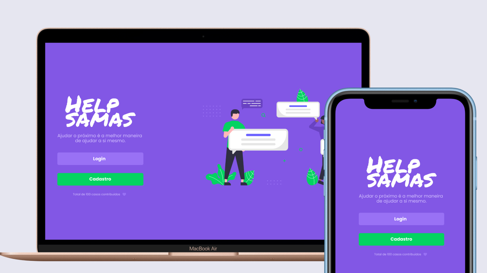

<h1 align="center">
    
</h1>

<h4 align="center"> 
:construction: 🚀 Aplicação em construção :construction:
</h4>

  
  
  
  
  
  
  

<!-- 

   -->

  <a href="#-project">Project</a>&nbsp;&nbsp;&nbsp;|&nbsp;&nbsp;&nbsp;
  <a href="#rocket-Technologies">Technologies</a>&nbsp;&nbsp;&nbsp;|&nbsp;&nbsp;&nbsp;
  <a href="#-layout">Layout</a>&nbsp;&nbsp;&nbsp;|&nbsp;&nbsp;&nbsp;
  <a href="#-how-to-contribute">How to contribute</a>&nbsp;&nbsp;&nbsp;|&nbsp;&nbsp;&nbsp;<a href="#-deploy">Deploy</a>&nbsp;&nbsp;&nbsp;|&nbsp;&nbsp;&nbsp;

## 💻 Project

Help Samas is a platform to help Samas residents
<h1 align="center">
    
</h1>

## :rocket: Technologies

This project was developed with the following technologies:

- [Laravel](https://laravel.com/)
- [React](https://reactjs.org)
- [Mysql](https://www.mysql.com/)
- [Redux](https://redux.js.org/)
- [Material Ui](https://mui.com/pt/)
- [Bootstrap](https://getbootstrap.com/)

## 🔖 Layout

Para acessar o layout utilize a ferramenta [Figma](https://www.figma.com/file/hciXVQUPVgJ56RQhHnUqSD/Help-Samas).

## 🤔 How to contribute

- Make a fork;
- Create a branck with your feature: `git checkout -b my-feature`;
- Commit changes: `git commit -m 'feat: My new feature'`;
- Make a push to your branch: `git push origin my-feature`.

After merging your receipt request to done, you can delete a branch from yours.

## :racehorse: Deploy

Área de deploy com linkls da aplicação

Seguem os links:
- [API Backend](https://)
- [Frontend](https://)
- [Código](https://)

#api #laravel #backend #frontend #react #redux #mui #bootstrap #appdeveloper #heroku #netlify #developer

Made with ♥ by Lucas Hoffmann :wave: [Get in touch!](https://www.linkedin.com/in/lucas-hoffmann-0435501b6/)
